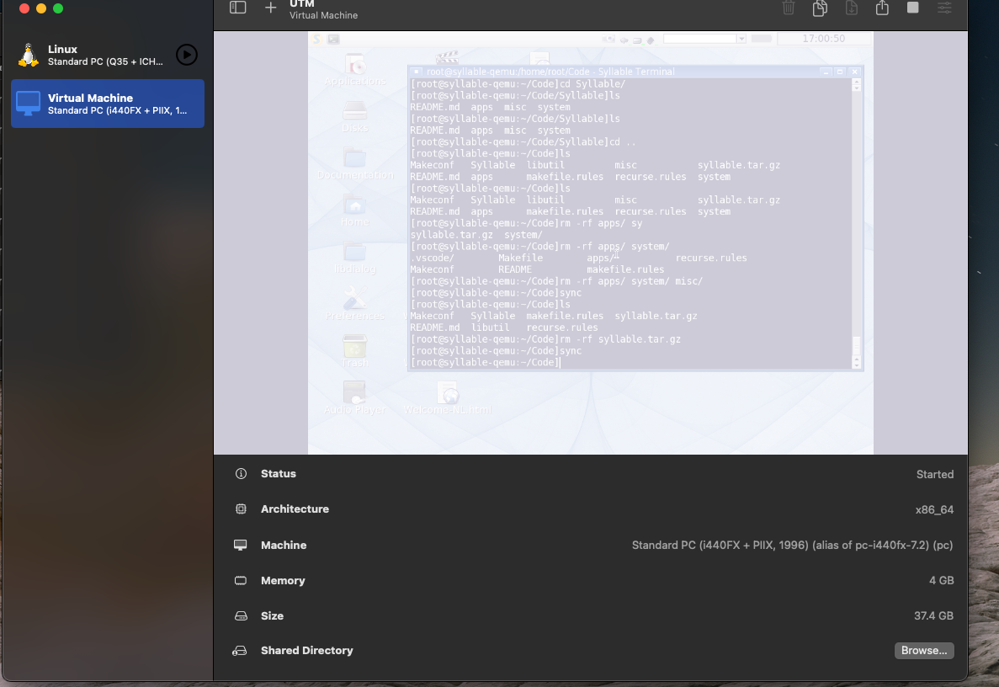

# Syllable Main Repo

---

This is the main repo that I will be putting changes in.

At some point this will be  merged into Pyro, but the structure
has changed so much that I want to be able to just focus on changes for now.


How am I compiling quickly
---

I am using qemu to compile on a Mac M2 with 32gb of ram.
Qemu is only reporting it as a 1000mhz single thread, something we will
have to fix.  For now, I am just syncing code over using rsync: 

```shell

alias syllable-rsync='(){ echo $1; rsync -acvzh $2 $1 --recursive --cvs-exclude --rsync-path=/usr/rsync/bin/rsync --exclude .git ;}'

#Run with: syllable-rsync "root@172.16.224.104:/home/root/Code/" ../Syllable


```

UTM looks like:
